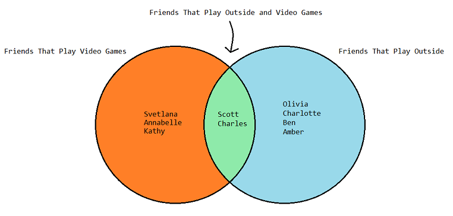

In code:
```python
friends_who_play_video_games = set(["Svetlana","Charles","Annabelle","Scott","Kathy"])
friends_who_play_outside = set(["Olivia","Charlotte","Ben","Amber","Scott","Charles"])
```

Using <code>union()</code>:
```python
>>> friends_who_play_video_games.union(friends_who_play_outside)
{'Svetlana', 'Kathy', 'Charles', 'Olivia', 'Annabelle', 'Amber', 'Charlotte', 'Ben', 'Scott'}
```
It contains all the elements of <code>friends_who_play_video_games</code> and <code>friends_who_play_outside</code>. The two elements <code>Chares</code> and <code>Scott</code>, both play video games and outside, so they also appear in the <code>union</code>.

Using <code>intersection()</code>:
```python
>>> friends_who_play_video_games.intersection(friends_who_play_outside)
{'Scott', 'Charles'}
```

We're only interested in the friends that play video games **and** play outside.

Using <code>difference</code>:
```python
>>> friends_who_play_video_games.difference(friends_who_play_outside)
{'Kathy', 'Svetlana', 'Annabelle'}
```

We're only interested in the friends that play video games, so we take out all the friends in the intersection, and play outside.
